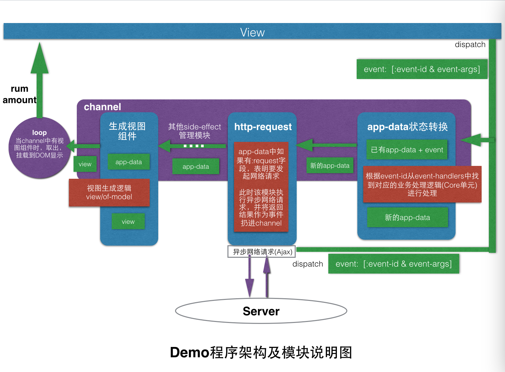

# Clojurescript实战——快速实现单页面应用

# 快速实现单页面应用

## 为何"快"？

#### Clojure与Clojurescript开发环境一致
* IntelliJ IDEA 
* lein（或boot)构建
* project.clj
* repl(cljs-repl)

对于Clojure程序员，无需为Clojurescript而另外构建学习一套新的开发环境构建工作。

#### figwheel hot loader
使用命令：

``` 
lein new figwheel project-name
```

可以快速构建一个基于figwheel的Clojurescript web开发环境，并且已自动配置了支持cljs-repl的插件。
figwheel的hot loader功能，可以将修改的代码实时编译并推送到浏览器展示出来。

#### cljs-repl

使用cljs-repl，让你可以像在clojure的repl中一样编写一些尝试性的js代码。

#### clojurescript 和 clojure语法、用法一致

在clojure中有的主要函数，基本上都有对应的cljs实现，接口一致，无额外的语法学习压力。

命名空间的定义，引用一致。

#### reagent、rum、re-frame等库的支持

reagent、rum等库基于React设计，通过数据驱动显示，为函数式编程语言提供了跳舞的平台（纯函数就是靠参数输入的数据驱动的）。

**总的来说：** 用Clojurescript是实现web前端，让我们在做前端的时候感觉不像是在做前端。让我们从烦杂的html元素操作中解放出来，真正专注于程序设计。

# 风林火山出品：一个比[re-frame](https://github.com/Day8/re-frame)还要好的web应用开发架构

这里以一个小demo来展示这个不到五十行代码的"架构"是如何驱动一个web应用程序的。

## 工程结构介绍

* project.clj中个配置大概作用描述。
* demo.html中`<div id="app"/>`的作用：提供一个挂载点，将clojurescript生成的页面挂在到该节点，以展示。
* figwheel在repl中启动演示。
* cljs-repl启动演示，在cljs-repl中执行.cljs/.cljc文件中的代码。
* .cljc文件的作用：既可供clj调用，又可以被cljs调用，cljc中的代码，可以向clojure代码一样，在`test`目录下进行单元测试。
* view.cljs(视图层), main.cljs+engine.cljs（集成控制层），core.cljs（业务模型层）。

## demo演示——纯函数快速实现View层

### 纯函数实现View层的优点
* 视图层的所有组件完全由纯函数实现，即给什么数据，就生成一个什么视图，它不关心数据的外部存储形式。
* 它要求使用者提供一个方法，将交互事件传递出去，事件结构为[event-type & 事件其他数据]，因此要求该方法可以接收一个该事件结构作为参数。
* 该单元没有引入任何其他依赖，即便后续要引入依赖，规定只能引入作用于该单元内部的依赖。
* 这样设计，大大增强了该视图组件的可重用性。
* 使用rum将纯函数生成的显示组件关在到页面上，通过修改model中的数据，就可以立即看到页面变化效果。

### 页面组件显示与不显示的两种方式

* 一种是通过条件判断决定是否要`生成`对应的组件，通过该组件是否存在来控制，如：

``` 
(defn of-model
  [{:keys [user-info] :as model}]
  [:div
   (when user-info
     (user-detail user-info dispatch))])
```

* 一种是通过条件判断决定是否要让浏览器`显示`或`隐藏`对应的组件，即通过式样控制，如：

``` 
[:div {:style {:display (if (pred) "block" "none")}}]
```

个人观点：两种方式视情况选择使用哪种。

第一种方式适用于组件中要显示的数据都应该用新数据来动态生成；

第二种方式适用于组件中要显示的数据为静态数据（或可被缓存的数据），只是现阶段不需要展示出来而已，后续需要显示。

第二种的性能应该更高。

## 纯函数实现Model层

* 业务逻辑单元负责处理各种事件，完全由纯函数实现：输入为整个app的数据model和各事件传递过来的数据，输出为新的数据model。
* 整个业务逻辑都是可单元测试的！TDD

## Demo架构设计

### demo演示业务流程

### demo架构设计及实现说明



整个架构就像是一条生成流水线，流水线上安装了不同的零部件来处理不同工序，每道工序处理上一道工序输出的产品。架构由`事件`驱动：

程序与外部交互（用户操作、网络请求回应）产生事件->事件被分发到生产流水线经过各道工序处理->应用状态更新-> 新的视图(成品) -> 上市。

生成线不断循环（loop）处理各种事件，不断更新应用的状态数据，推动显示界面不断变化。

* **架构的核心实现**

特别简单（精妙）：一个core.async中的channel + 一组transducer函数(用于处理各道工序)。

事件排队进入channel，经过channel中的各个transducer函数处理后，生成最终要呈现的视图。

一个`async/go-loop`循环从channel中取出生成的视图，并通过`rum/mount`挂在到DOM上显示出来。

* **两个核心数据结构：** app-data(应用的全部状态数据)，event（事件）

app-data数据结构如下：
```clojure 
(def app-data
    {:db {} ;; 生成视图的输入数据，view单元专用；view = (view/of-model (assoc db :dispatch dispatch-fn))
     :request {} ;; 网络请求数据所需数据；
     :once-timer {} ;; 当输出的app-data带有once-timer时，表明要启动定时器
     ;; ... 其他需要处理side-effect模块所需的数据。
    })
``` 

event的数据结构如下：
```clojure
(def event 
  [:event-id event-data1 event-data2 ....]
  )
```

* **事件的分发（dispatch）**

例如在用户操作页面（on-click）会产生一个事件并通过`dispatch`函数分发出。

在本架构中，会被put到channel中，即dispatch为：

```clojure
(def dispatch (partial async/put! ch))
```

但仅在开发View层时，还不涉及到业务集成，无需使用channel，此时可以将`dispatch`定义为一个调试输出函数（log 或 alert）等，

以协助View层的开发，如：

```clojure
(def dispatch #(js/alert (str %)))
```

* **应用状态（app-data）管理模块的实现**

特别简单（精妙）：一个transducer函数(reductions)：

```clojure
(defn map-reductions
  "返回 transform 函数：对 init-model 进行连续变换，产生新的 model 状态，
  f-map 是一个函数（map）以事件 id 为参数，返回函数将事件作用到 model 上。

  f-map 为该引擎的使用者提供了非常灵活的操作空间，就像ring库一样，使用者可以自定义一堆中间件"
  [f-map init-model]
  (x/reductions
    (fn [model [event-id & payload]]
      (apply (f-map event-id) model payload))
    init-model))
```
状态管理居然是用一个纯函数实现的！！

* **side-effect（副作用）处理**
side-effect：例如读写网络数据，定时器等，以读写网络数据为例：

业务处理时，出现从网络请求数据的情况，我们通过在app-data中添加`:request {发起网络请求所需要的数据}`，并在业务模型之外的地方处理这种请求，

以保证整个业务模型是纯函数的。如demo中请求用户信息，真正的请求是在`http-request`模块发生的。

另外，通过`defmulti`可以实现side-effect处理函数的本地版本和真实运行版本，提升开发效率。

* **生成视图组件**

使用rum来生成，但此处rum仅仅起到"胶水"的作用，所有视图组件生成逻辑都由View单元的纯函数实现！

* **视图组件渲染**

一个`go-loop`等待从channel中取出view，并渲染到页面上。
```clojure
(defn app-ch
  "返回程序通道: 它将使用 x-form 这个 transform 函数将每个事件 event
  转化为 view (rum 组件)，并将其渲染到 elem (HTMLElement) 上"
  [x-form elem]
  (let [input-ch (async/chan 1 x-form)]
    (async/go-loop []
                   (when-let [view (async/<! input-ch)]
                     (rum/mount view elem)
                     (recur)))
    input-ch))
```

### 架构的主要优点

* 全文一个swap!操作都没有，业务逻辑、视图生成逻辑，全部都是纯函数实现，连整个应用的状态转换都是纯函数的！
* 短小精悍，核心代码二十行而已，且用的都是clojure普普通通（jing miao qiang han）的特性:core.async channel和transducer。
* `map-reductions`函数中的`f-map`参数和 `app-ch`函数中的`x-form`参数为其留下了足够大的可扩展空间。
* 事件（数据）驱动。通过数据而非直接函数调用来降低模块间的耦合，实现零部件的灵活替换(只要你能处理这种数据就OK)，如http-request。

### 架构存在的不足

* 没有封装成独立的库：
    * 懒得想名字。
    * 一提到封装成独立的库，就会想着实现各种可能（而实际应用需要可能就一点点）。
    * 因为架构过于精简，学习接口的时间还不如直接看源码实现。
* 代码还有待优化，有些细节方面还有点瑕疵。
* 一些和业务无关的实现细节暴露给了使用者，如main.cljs中的`wrap-app-dispatcher`和`::boot`等。


--- 

# 用Clojure的公司貌似很少，学Clojure有没有前途？——我也这样问过我自己

## 从Clojure语言本身考虑

个人觉得Clojure的未来是很光明的，基于以下几点考虑：

* 站在巨人的肩膀上横空出世（JVM，LISP），集各家之所长，无历史包袱;
* Clojure语言设计思想先进，紧跟历史发展新潮流：
    * 本身函数式编程就越来越受关注，java8,9中引入了对函数式编程的支持。
    * repl：java9中引入了repl(jshell)；
    * 个人觉得，当前程序设计的关键词越来越聚焦于`数据`、`资源`，如Restful服务架构、
      消息队列，Facebook的graphQL(虽然不火)等等。Clojure设计时，连函数都设计成了数据，可以像数据一样自由使用。
    * ->/->>: java8新增Stream API.
    * 函数也是数据：貌似C++中也增加在函数中定义一个函数并作为返回值返回的特性？？
    * 匿名函数：java8 和C++都引入了lambda表达式来实现匿名函数和匿名类。
    * Clojure(script)：javascript/Node.js。同一种语言写前后端。
    * {:a [1 "2] }：C++增加auto类型推导，以支持更灵活的数据结构设计。
    * 。。。
* 可以看出，很多我们觉得在clojure很平常的东西，在其他语言中可能都要费劲心思才能引入。而引入之后有时感觉和
  原来的语言风格又格格不入，如java中引入的lamba表达式，感觉像是在java中学习了一种新语言。。。
  这应该是clojure"优雅"的原因之一。
* 个人觉得，当前程序设计的关键词越来越聚焦于`数据`、`资源`，如Restful服务架构、
  消息队列，Facebook的graphQL(虽然不火)等等。Clojure设计时，连函数都设计成了数据，可以像数据一样自由使用。
    
## clojure给我在程序设计和开发中带来的一些启示

### 鼓励编写纯函数

纯函数的优点：

* 易于单元测试，非常适合测试驱动开发（和repl驱动开发）。
* 无副作用、安全。
* 可缓存结果，提升性能；

在C/C++ 或 Java中，很难写出大量的纯函数。我们经常将引用（指针）作为参数传入函数，在函数内修改值；
或者是在一个对象的方法中，为一个成员变量赋值；或是将一个或多个输入参数作为输出来用... 

这是因为C/C++、Java语言表达能力不足导致。例如，很多时候我们希望函数的返回值并不仅仅是int，或是某个已定义类，可能是即有
int，又有字符串的`一组`临时数据，在Java或C/C++代码中，不可能为这组临时数据定义一个专门的类或其他数据结构，
因此只好通过输入参数、修改全局变量、甚至是通过抛出异常的方式来输出了。

而在clojure中，你可以写出大量的纯函数（甚至说你不想写都难），因为：

* clojure的表达能力很强，返回诸如`[1 "hello"]`等数据结构非常容易。

* 因为clojure使用的是`不可变数据结构`。

* 其提供的几个可变结构（如`Atom`, `ref`等），其设计目的更多的是处理STM（软事务），而非让你写非纯函数。况且要修改它们的
  值并非直接用等号赋值那么简单，因此不得已的情况下，你不会想用它们。

### 一致性（概括的比较笼统）

Clojure的一致性表现在：
 
* 同像性（homoiconic）

最显著的表现是其代码与数据结构一致，如代码`(def a 1)`其本身就是一个`list`。

这种设计思想同样也体现在Richy设计的Datomic数据库中：

在datomic数据中，`entity`中的各个属性（attr），其本身也是一个`entity`。

* 一致的数据操作接口

如`map`函数，可以处理`list`，`vector`，`set`，`map`等结构。

### "数据 > 函数 > 宏"

可以从三方面理解：

#### 函数也是数据

虽然在函数式编程语言Clojure中，"函数"号称为头等公民，但在clojure中，函数本身也是数据，它和其他数据一样。
比如可以作为参数，传入到其他函数中；保存在一个map中... 

因此，Clojure很容易组合出强大的高阶函数，典型代表：ring的中间件中一堆wrap-...函数。
  
在C/C++ 或 Java中，要实现将一个函数作为参数传入比较麻烦（麻烦的函数指针，接口）。

#### 解耦、灵活性

* 两个模块或服务之间通过数据传递带来的耦合性要小于通过函数调用所带来的耦合性；
* 使用数据来表达模块间（或服务间）的接口，其灵活性要高于用函数表达的接口。典型的代表就是RESTful API和RPC服务的API。

#### 程序设计

程序设计过程中，数据结构设计优先于函数设计，数据结构的定义，往往决定了程序设计的好坏。

如clojure使用一个`list`结构可以表达其代码；`map`，`vector`等数据结构
可以相互嵌套、不要求类型一致等，非常灵活；这些好的数据结构设计，是clojure能如此"优雅"的重要原因。

Clojure鼓励我们写纯函数，而在写纯函数之前，应该先设计函数的输入和输出，其目标，还是数据。

如Rest风格服务设计，以资源作为抽象工具，围绕的核心还是数据的设计。

如React等数据驱动显示的库，同样鼓励我们优先设计数据结构。


